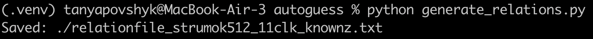
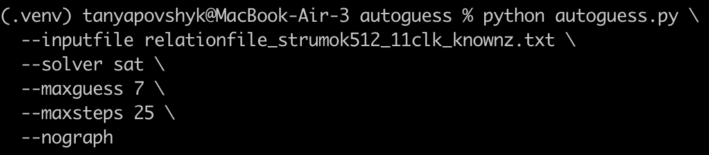
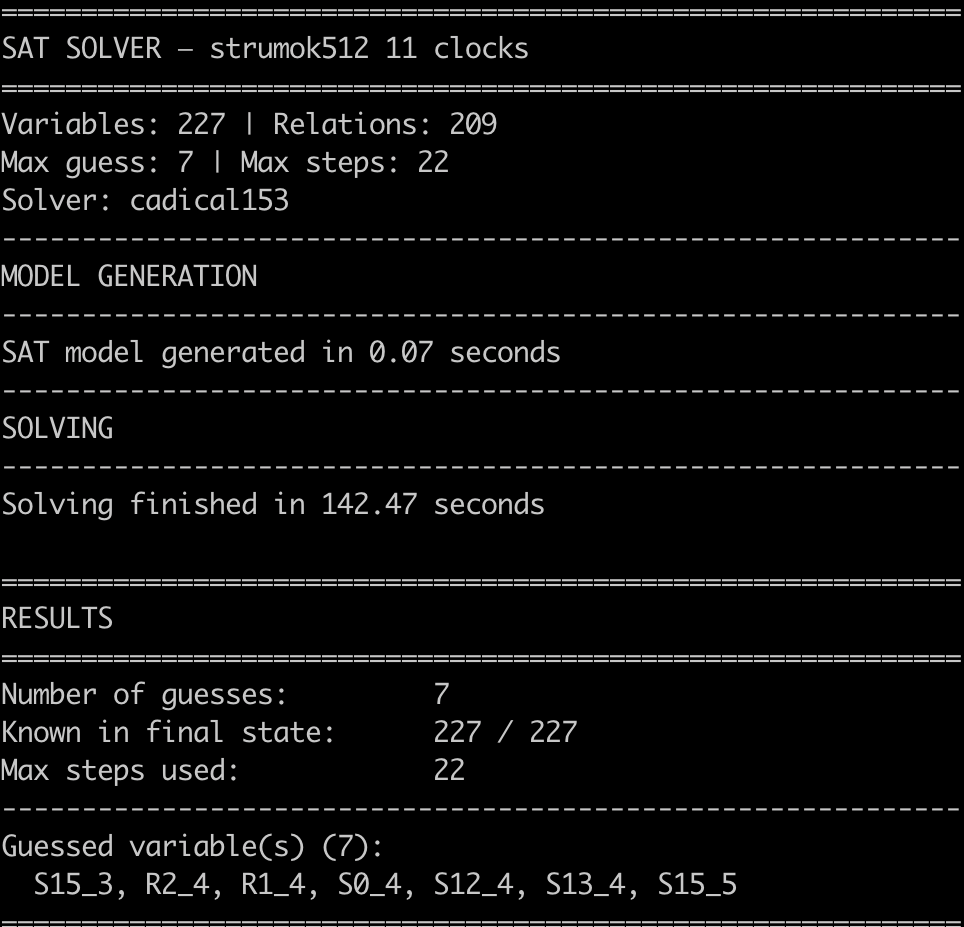

# Report

## Теоретичні відомості 

Потокові шифри будуються на генерації псевдовипадкової гами, яка далі комбінується з відкритим текстом за допомогою операції XOR. Безпека такого підходу залежить від складності відновлення внутрішнього стану генератора гами.

У більшості сучасних потокових шифрів внутрішній стан має велику розмірність і складається з декількох компонентів, таких як:
* лінійні регістри зсуву (LFSR),
* нелінійні блоки (S-box, FSM),
* допоміжні змінні.

Ці компоненти утворюють складну систему залежностей, яка визначає еволюцію стану у часі.

Суть атаки часткового вгадування

Атака часткового вгадування (Guess-and-Determine) базується на ідеї розділення змінних внутрішнього стану на дві групи: вгадувані змінні (guess variables) nf обчислювані змінні (determined variables).
Замість повного перебору всього стану (що має експоненційну складність), атакуючий: вгадує лише частину змінних, а всі інші обчислює через відомі залежності.
Формально, якщо повний стан має розмір n, а базис - k, то складність атаки зменшується з 2^n до 2^k, де k << n.

Представлення шифру у вигляді системи рівнянь

Кожна змінна внутрішнього стану описується як функція від інших змінних. У випадку потокових шифрів ці функції часто мають вигляд:

X = A XOR B XOR C, або складніших нелінійних залежностей.

У такому представленні вершини відповідають змінним, а ребра — залежностям між ними. Це дозволяє розглядати шифр як орієнтований граф залежностей.

Побудова атаки як задачі SAT

Сучасні підходи, зокрема Autoguess, зводять задачу пошуку базису до задачі булевої задовільності (SAT).
Основна ідея:
* кожна змінна представляється як булева змінна,
* залежності між змінними переводяться у логічні обмеження,
* задача полягає у знаходженні такого набору змінних (базису), який мінімізує кількість вгадувань.

SAT-розв’язувач дозволяє: автоматично знаходити оптимальні або близькі до оптимальних базиси, враховувати обмеження на кількість кроків (steps), оцінювати складність атаки.

Особливості атаки для шифру Струмок

Шифр Струмок має складну структуру, яка включає:
* 16 регістрів LFSR,
* скінченний автомат (FSM),
* функцію генерації вихідної гами.

Основною особливістю є використання 64-бітних слів та великого внутрішнього стану (до 1152 біт для Струмок-512).
З одного боку, це підвищує криптостійкість, але з іншого - наявність великої кількості залежностей дозволяє будувати ефективні моделі для атак типу guess-and-determine.
Дослідження показують, що для Струмок-512 існують базиси, які дозволяють зменшити складність атаки до 2^448, що значно менше повного перебору.

Обмеження та практична застосовність

Незважаючи на зменшення складності, атака часткового вгадування залишається експоненційною, все ще потребує значних обчислювальних ресурсів та у більшості випадків є теоретичною. Проте її значення полягає у оцінці криптостійкості алгоритму, виявленні структурних слабкостей, порівнянні різних шифрів між собою.

## Реалізація

Виміри швидкості в режимі release для реалізації струмка-256 та струмка-512. Для чистоти виміру було згенеровани 1000 000 блоків гами(близько 8 мегабайт). Для того, щоб оптимізатор C++ не проігнорував цикл генерації, кожне згенероване слово гами акумулювалося за допомогою операції XOR у змінну block_for_test, значення якої виводилося в кінці роботи функції.

Обчислений час виконання ділився на загальну кількість згенерованих бітів, щоб отримати фінальний результат у гігабітах на секунду.

Також, для перевірки реалізації були написані тести за прикладами для перевірки в документі **ДСТУ 8845:2019.**

## Використання інструменту Autoguess

Для автоматизації побудови атаки було використано інструмент Autoguess, який дозволяє знаходити оптимальні базиси для атак типу guess-and-determine.

На першому етапі було сформовано файл залежностей, який описує взаємозв’язки між змінними внутрішнього стану шифру Струмок-512. У моделі враховано:
* значення регістрів S_i^(t),
* значення регістрів R_i^(t),
* вихідні біти Z_t.

Кожен рядок у файлі описує залежність виду:
X = A XOR B XOR C

Після побудови моделі інструмент Autoguess було запущено з використанням SAT-розв’язувача.

Команди запуску

Отримані результати

Було визначено, що існує набір змінних (базис), після вгадування яких інші змінні можуть бути відновлені.

Кількість змінних у базисі визначає складність атаки. У даному випадку вона оцінюється на рівні: 2^448, що відповідає відомим результатам для шифру Струмок-512.

Отриманий результат означає, що замість перебору всього внутрішнього стану (понад 1000 біт), достатньо перебрати лише значення базису.
Після цього всі інші змінні визначаються детерміновано через систему залежностей. Таким чином складність атаки значно зменшується, але залишається експоненційною,що забезпечує практичну криптостійкість шифру.

Приклад знаходження всього внутрішнього стану за вгаданими 7 значеннями(attack_simulation_for_t4()):

І тут маємо порівняння зі справжніми значеннями регістрів та обрахованими завдяки оборотним функціям:

## Порівняльний аналіз шифру Струмок та ZUC:

Можемо побачити, що цей шифр також має 16 основних регістрів, але кожен з яких містить лише 31 біт. Як і у версії Струмок-256, версія ZUC-128 має 4 слова ключа та 4 слова вектора ініціалізації. Але головна відмінність все ще залишається —  слово містить лише 32 біта. Завдяки збільшенню розміру слова до 64 бітів, Струмок забезпечує вищу швидкодію на програмному рівні (до 10 Гбіт/с)

### Версії:

- ZUC(128) та ZUC(256)
- Струмок-256 та Струмок-512

### Алгоритм ZUC:

1. **LFSR:** Лінійний регістр зсуву.
2. **BR:** Шар реорганізації бітів (для розриву лінійності).
3. **FSM:** Скінченний автомат із нелінійними S-блоками.

складається з трьох основних рівнів, що схоже на архітектуру Струмка:

1. LFSR
2. Скінченний автомат (FSM)
3. Функція виходу (генерація гами)

### Стійкість:

Хоч і через архітектурну схожість Струмок та ZUC не є стійкими до атаки часткового вгадування, Струмок має кардинальну перевагу у криптостійкості завдяки більшому внутрішньому стану(64-бітні слова) та 512-бітному ключу. Адже теоретична складність зламу ZUC зазвичай обмежується довжиною його ключа (128 або 256 біт), то знайдений базис для Струмка вимагає (2)^ 448 операцій для зламу.

## Порівняльний аналіз шифру Струмок та ChaCha20

На відміну від Струмка та ZUC, шифр ChaCha20 має зовсім іншу будову. Його внутрішній стан також містить 16 основних слів(які можуть бути представлені або вектором, або матрицею), але кожне слово має розмір лише 32 біти. Хоча Струмок за рахунок 64-бітних слів забезпечує високу швидкодію (до 10 Гбіт/с), ChaCha20 не відстає завдяки простим операціям.

### Версії:

- ChaCha: ChaCha20 (стандарт з 256-бітним ключем), існують версії зі зменшеною кількістю раундів — ChaCha8 та ChaCha12.
- Струмок-256 та Струмок-512.

### Алгоритм ChaCha20:

- ARX-архітектура: Побудований виключно на трьох базових операціях: додавання, циклічний зсув та XOR.
- Раундове перемішування: не має LFSR чи скінченних автоматів. Бере блок із 512 бітів і пропускає його через 20 раундів перемішування.

Струмок складається з трьох рівнів: LFSR, Скінченний автомат (FSM) та функція виходу.

### **Стійкість:**

Якщо Струмок аналізують через атаки часткового вгадування (де складність зламу вимагає (2)^ 448 операцій), то до ChaCha20 застосовують диференціальний криптоаналіз. Зараз повні 20 раундів ChaCha20 вважаються абсолютно надійними (вдалося атакувати лише скорочені версії до 7-8 раундів).

## Використані джерела:

1. [https://scispace.com/pdf/a-different-algebraic-analysis-of-the-zuc-stream-cipher-4ru78vugwy.pdf](https://scispace.com/pdf/a-different-algebraic-analysis-of-the-zuc-stream-cipher-4ru78vugwy.pdf)
2. [http://mia.univer.kharkov.ua/19/30258.pdf](http://mia.univer.kharkov.ua/19/30258.pdf)
3. [https://datatracker.ietf.org/doc/html/rfc7539](https://datatracker.ietf.org/doc/html/rfc7539)
4. [https://en.wikipedia.org/wiki/ChaCha20-Poly1305](https://en.wikipedia.org/wiki/ChaCha20-Poly1305)
5. [https://en.wikipedia.org/wiki/Salsa20#ChaCha_variant](https://en.wikipedia.org/wiki/Salsa20#ChaCha_variant)
