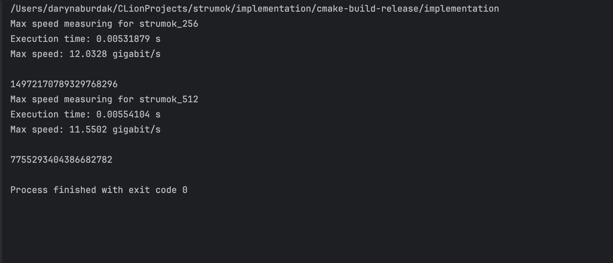
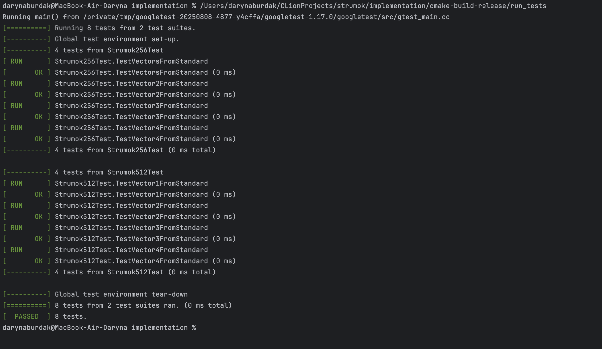
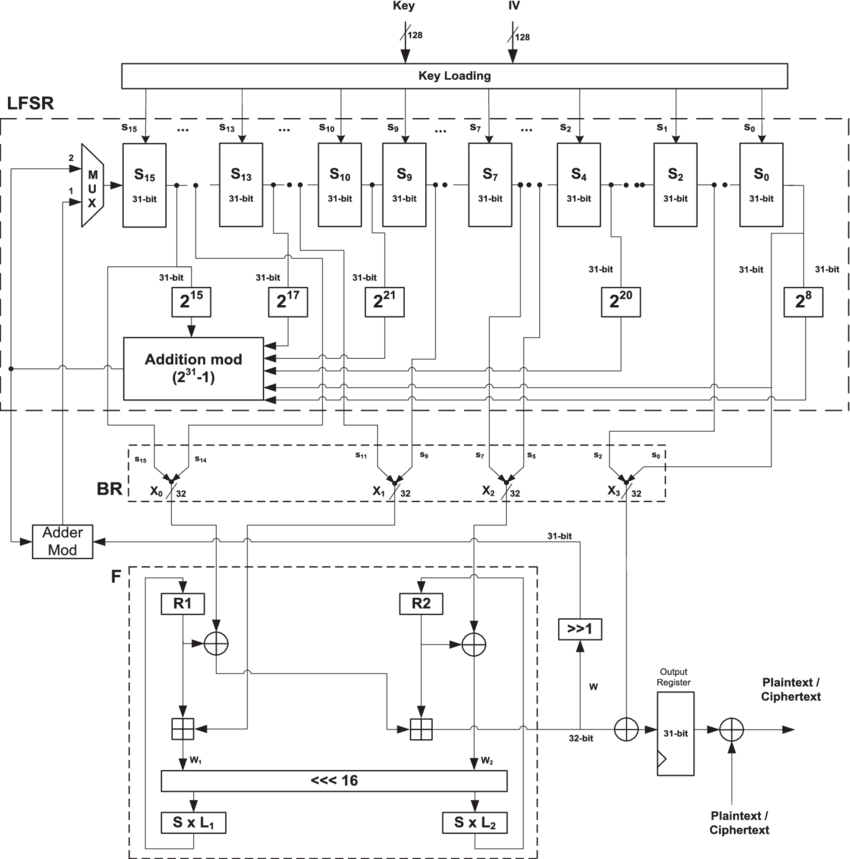

# Report

## Реалізація

Виміри швидкості в режимі release для реалізації струмка-256 та струмка-512. Для чистоти виміру було згенеровани 1000 000 блоків гами(близько 8 мегабайт). Для того, щоб оптимізатор C++ не проігнорував цикл генерації, кожне згенероване слово гами акумулювалося за допомогою операції XOR у змінну block_for_test, значення якої виводилося в кінці роботи функції.

Обчислений час виконання ділився на загальну кількість згенерованих бітів, щоб отримати фінальний результат у гігабітах на секунду.

Також, для перевірки реалізації були написані тести за прикладами для перевірки в документі **ДСТУ 8845:2019.**

## Порівняльний аналіз шифру Струмок та ZUC:

Можемо побачити, що цей шифр такоє має 16 основних регістрів, але кожен з яких містить лише 31 біт. Як і у версії Струмок-256, версія ZUC-128 має 4 слова ключа та 4 слова вектора ініціалізації. Але головна відмінність все ще залишається —  слово містить лише 32 біта. Завдяки збільшенню розміру слова до 64 бітів та розширенню внутрішнього стану до 1152 бітів, «Струмок» забезпечує вищу швидкодію на програмному рівні (до 10 Гбіт/с)

### Версії:

- ZUC(128) та ZUC(256)
- Струмок-256 та Струмок-512

### Алгоритм ZUC:

1. **LFSR:** Лінійний регістр зсуву.
2. **BR:** Шар реорганізації бітів (для розриву лінійності).
3. **FSM:** Скінченний автомат із нелінійними S-блоками.

складається з трьох основних рівнів, що схоже на архітектуру Струмка:

1. LFSR
2. Скінченний автомат (FSM)
3. Функція виходу (генерація гами)

### Стійкість:

Хоч і через архітектурну схожість Струмок та ZUC не є стійкими до атаки часткового вгадування, Струмок має кардинальну перевагу у криптостійкості завдяки більшому внутрішньому стану(64-бітні слова) та 512-бітному ключу. Адже теоретична складність зламу ZUC зазвичай обмежується довжиною його ключа (128 або 256 біт), то знайдений базис для Струмка вимагає (2)^ 448 операцій для зламу.

## Порівняльний аналіз шифру Струмок та ChaCha20

На відміну від Струмка та ZUC, шифр ChaCha20 має кардинально іншу будову. Його внутрішній стан також містить 16 основних слів(які можуть бути представлені або вектором, або матрицею), але кожне слово має розмір лише 32 біти. Хоча Струмок за рахунок 64-бітних слів забезпечує надзвичайно високу швидкодію (до 10 Гбіт/с), ChaCha20 не відстає завдяки своїй простій математиці, *яка ідеально оптимізується під векторні інструкції процесорів (SIMD/AVX2) без потреби у спеціальному апаратному прискоренні.*

### Версії:

- ChaCha: ChaCha20 (стандарт з 256-бітним ключем), існують версії зі зменшеною кількістю раундів — ChaCha8 та ChaCha12.
- Струмок-256 та Струмок-512.

### Алгоритм ChaCha20:

- ARX-архітектура: Побудований виключно на трьох базових операціях: додавання, циклічний зсув та XOR.
- Раундове перемішування: не має LFSR чи скінченних автоматів. Бере блок із 512 бітів і пропускає його через 20 раундів перемішування.

Струмок складається з трьох рівнів: LFSR, Скінченний автомат (FSM) та функція виходу.

### **Стійкість:**

Якщо Струмок аналізують через атаки часткового вгадування (де складність зламу вимагає (2)^ 448 операцій), то до ChaCha20 застосовують диференціальний криптоаналіз. Зара повні 20 раундів ChaCha20 вважаються абсолютно надійними (вдалося атакувати лише скорочені версії до 7-8 раундів).

## Використані джерела:

1. [https://scispace.com/pdf/a-different-algebraic-analysis-of-the-zuc-stream-cipher-4ru78vugwy.pdf](https://scispace.com/pdf/a-different-algebraic-analysis-of-the-zuc-stream-cipher-4ru78vugwy.pdf)
2. [http://mia.univer.kharkov.ua/19/30258.pdf](http://mia.univer.kharkov.ua/19/30258.pdf)
3. [https://datatracker.ietf.org/doc/html/rfc7539](https://datatracker.ietf.org/doc/html/rfc7539)
4. [https://en.wikipedia.org/wiki/ChaCha20-Poly1305](https://en.wikipedia.org/wiki/ChaCha20-Poly1305)
5. [https://en.wikipedia.org/wiki/Salsa20#ChaCha_variant](https://en.wikipedia.org/wiki/Salsa20#ChaCha_variant)